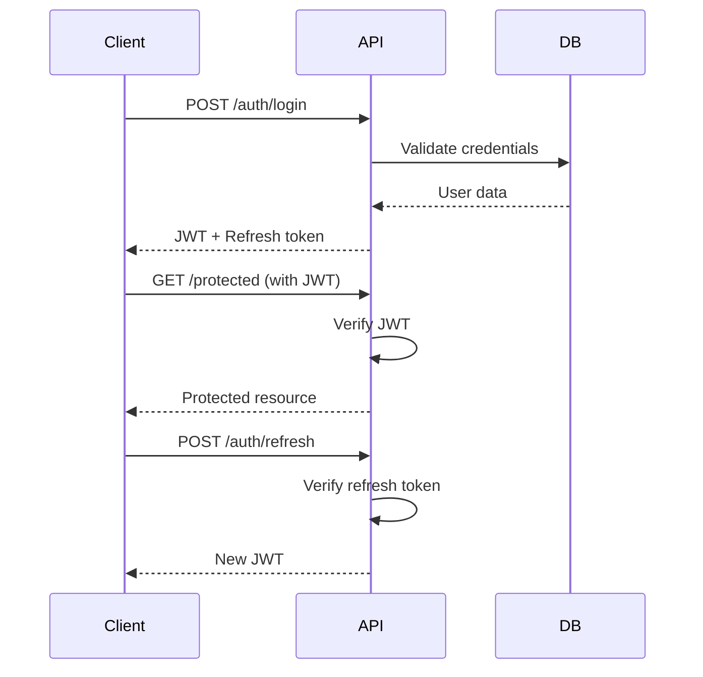

# 🎓 Beasiswa Platform - Backend API

<div align="center">
  
  
  
  
  
</div>

<div align="center">
  <h3>🚀 RESTful API untuk Platform Manajemen Beasiswa</h3>
  <p>Backend service yang robust dengan authentication, authorization, dan file management</p>
</div>

---

## ✨ Fitur Backend

### 🔐 Authentication & Authorization

- JWT-based authentication
- Role-based access control (RBAC)
- Password hashing dengan bcrypt
- Token refresh mechanism

### 📊 Core Modules

- **👥 User Management** - CRUD operations untuk semua role
- **🏛️ Academic Structure** - Fakultas dan Departemen
- **🎓 Scholarship Management** - Beasiswa dan kategori
- **📝 Application Processing** - Pengajuan dan workflow
- **📄 File Management** - Upload dan validasi dokumen

### 🛡️ Security Features

- SQL injection prevention
- XSS protection
- File upload validation
- Rate limiting
- CORS configuration

---

## 🛠️ Tech Stack

- **🟢 Node.js** - JavaScript runtime environment
- **🚀 Express.js** - Fast, minimalist web framework
- **🗄️ Sequelize ORM** - Promise-based Node.js ORM
- **🐬 MySQL** - Relational database management
- **🔒 bcrypt** - Password hashing library
- **🎫 jsonwebtoken** - JWT implementation
- **📧 Nodemailer** - Email sending capability
- **📁 Multer** - File upload handling
- **✅ Joi** - Data validation library

---

## 📁 Struktur Proyek

```
backend-beasiswa/
├── 📂 controllers/              # Business logic layer
│   ├── 🔐 auth.controller.js    # Authentication logic
│   ├── 👥 user.controller.js    # User management
│   ├── 🏛️ faculty.controller.js # Faculty operations
│   ├── 🎓 scholarship.controller.js
│   └── 📝 application.controller.js
├── 📂 models/                   # Database models
│   ├── 👤 user.js               # User model
│   ├── 🏛️ faculty.js            # Faculty model
│   ├── 📚 department.js         # Department model
│   └── 🎓 scholarship.js        # Scholarship model
├── 📂 routes/                   # API route definitions
│   ├── 🔐 auth.routes.js        # Auth endpoints
│   ├── 👥 user.routes.js        # User endpoints
│   └── 📊 *.routes.js           # Other route files
├── 📂 middleware/               # Custom middleware
│   ├── 🔒 auth.middleware.js    # JWT verification
│   ├── 👮 role.middleware.js    # Role checking
│   └── 📁 upload.middleware.js  # File upload
├── 📂 migrations/               # Database migrations
├── 📂 seeders/                  # Database seeders
├── 📂 utils/                    # Utility functions
│   ├── 📨 response.js           # Response helpers
│   ├── ✅ validation.js         # Input validation
│   └── 📧 mailer.js             # Email utilities
├── 📂 uploads/                  # File upload directory
├── ⚙️ config/                   # Configuration files
├── 🚀 server.js                 # Application entry point
└── 📄 package.json
```

---

## 🚀 Quick Start

### Prerequisites

- 📋 Node.js (v16+)
- 🐬 MySQL (v8.0+)
- 📦 npm atau yarn

### 1️⃣ Clone & Install

```bash
git clone https://github.com/username/beasiswa-platform-backend.git
cd beasiswa-platform-backend
npm install
```

### 2️⃣ Database Setup

```bash
# Create database
mysql -u root -p
CREATE DATABASE beasiswa_db;

# Configure environment
cp .env.example .env
# Edit .env dengan credentials database
```

### 3️⃣ Migration & Seeding

```bash
# Run migrations
npx sequelize-cli db:migrate

# Seed initial data
npx sequelize-cli db:seed:all
```

### 4️⃣ Start Server

```bash
# Development mode
npm run dev

# Production mode
npm start

# Server running on http://localhost:5000
```

---

## 🔧 Environment Variables

```env
DB_HOST=
DB_USER=
DB_PASS=
DB_NAME=
DB_DIALECT=

JWT_ACCESS_SECRET=
JWT_REFRESH_SECRET=
JWT_RESET_PASSWORD_SECRET=

EMAIL_USER=
EMAIL_PASSWORD=
EMAIL_FROM=
FRONTEND_URL=
```

---

## 📝 API Documentation

### 🔐 Authentication Endpoints

```http
POST   /api/auth/login            # User login
POST   /api/auth/register         # User registration
POST   /api/auth/refresh          # Refresh JWT token
POST   /api/auth/logout           # User logout
POST   /api/auth/forgot-password  # Password reset request
POST   /api/auth/reset-password   # Reset password
```

### 👥 User Management

```http
GET    /api/users                 # Get all users (Admin only)
GET    /api/users/:id             # Get user by ID
POST   /api/users                 # Create new user (Admin)
PUT    /api/users/:id             # Update user
DELETE /api/users/:id             # Deactivate user
PUT    /api/users/:id/activate    # Activate user
```

### 🏛️ Academic Structure

```http
# Faculties
GET    /api/faculties             # Get all faculties
POST   /api/faculties             # Create faculty
PUT    /api/faculties/:id         # Update faculty
DELETE /api/faculties/:id         # Deactivate faculty

# Departments
GET    /api/departments           # Get all departments
POST   /api/departments           # Create department
PUT    /api/departments/:id       # Update department
DELETE /api/departments/:id       # Deactivate department
```

### 🎓 Scholarship Management

```http
GET    /api/scholarships          # Get scholarships
POST   /api/scholarships          # Create scholarship
PUT    /api/scholarships/:id      # Update scholarship
DELETE /api/scholarships/:id      # Delete scholarship

# Applications
GET    /api/applications          # Get applications
POST   /api/applications          # Submit application
PUT    /api/applications/:id      # Update application
POST   /api/applications/:id/verify # Verify application
```

---

## 🗄️ Database Schema

### Core Tables

```sql
-- Users table with role-based system
users (
  id, username, email, password, role,
  faculty_id, department_id, profile_data,
  is_active, created_at, updated_at
)

-- Academic structure
faculties (id, name, code, is_active)
departments (id, name, code, degree, faculty_id, is_active)

-- Scholarship system
scholarships (id, name, description, requirements, deadline)
applications (id, user_id, scholarship_id, status, documents)
verifications (id, application_id, verifier_id, status, notes)
```

### Relationships

- User **belongsTo** Faculty, Department
- Department **belongsTo** Faculty
- Application **belongsTo** User, Scholarship
- Verification **belongsTo** Application, User

---

## 🔐 Authentication Flow



---

## 🛡️ Security Implementation

### JWT Middleware

```javascript
const verifyToken = (req, res, next) => {
  const token = req.headers.authorization?.split(" ")[1];

  if (!token) {
    return res.status(401).json({
      success: false,
      message: "Access token required",
    });
  }

  try {
    const decoded = jwt.verify(token, process.env.JWT_SECRET);
    req.user = decoded;
    next();
  } catch (error) {
    return res.status(401).json({
      success: false,
      message: "Invalid token",
    });
  }
};
```

### Role-based Access

```javascript
const requireRole = (roles) => (req, res, next) => {
  if (!roles.includes(req.user.role)) {
    return res.status(403).json({
      success: false,
      message: "Insufficient permissions",
    });
  }
  next();
};

// Usage: requireRole(['admin', 'verifikator'])
```

---

## 📁 File Upload System

### Configuration

```javascript
const multer = require("multer");

const storage = multer.diskStorage({
  destination: (req, file, cb) => {
    cb(null, process.env.UPLOAD_PATH);
  },
  filename: (req, file, cb) => {
    const uniqueName = Date.now() + "-" + Math.round(Math.random() * 1e9);
    cb(null, uniqueName + path.extname(file.originalname));
  },
});

const fileFilter = (req, file, cb) => {
  const allowedTypes = process.env.ALLOWED_FILE_TYPES.split(",");
  const fileExt = path.extname(file.originalname).slice(1);

  if (allowedTypes.includes(fileExt.toLowerCase())) {
    cb(null, true);
  } else {
    cb(new Error("File type not allowed"), false);
  }
};
```

---

## 📧 Email Service

### Nodemailer Setup

```javascript
const transporter = nodemailer.createTransporter({
  host: process.env.SMTP_HOST,
  port: process.env.SMTP_PORT,
  secure: false,
  auth: {
    user: process.env.SMTP_USER,
    pass: process.env.SMTP_PASS,
  },
});

const sendVerificationEmail = async (to, verificationLink) => {
  const mailOptions = {
    from: process.env.SMTP_USER,
    to,
    subject: "Verifikasi Akun Beasiswa Platform",
    html: `<p>Klik link berikut: <a href="${verificationLink}">Verifikasi</a></p>`,
  };

  await transporter.sendMail(mailOptions);
};
```

---

## 📦 Deployment

### Production Setup

```bash
# Build for production
npm run build

# Start with PM2
npm install -g pm2
pm2 start ecosystem.config.js

# Or with Docker
docker build -t beasiswa-backend .
docker run -p 3000:3000 beasiswa-backend
```

---

## 📄 Related Repositories

- 🎨 **Frontend React**: [beasiswa-platform-frontend](https://github.com/paybackretr0/frontend-beasiswa-platform)

---

<div align="center">
  <p>Built with 🟢 Node.js & ❤️ for scalable backend services</p>
  <p>⭐ Star this repo if you find it helpful!</p>
</div>
